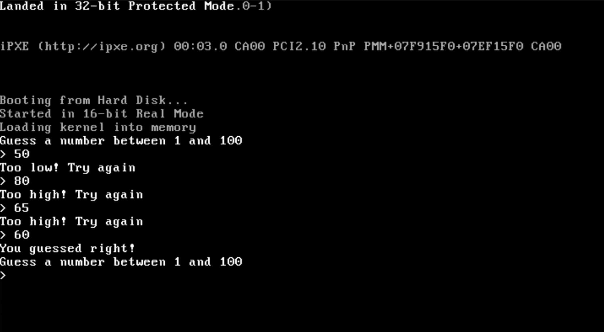

# guess-the-number-os
A bare metal operating system kernel to play Guess the Number on



## Features
- Guess the Number
- 32-bit
- custom bootloader
- pseudo-random number generator

## Resources
Thanks to [@cfenollosa](https://github.com/cfenollosa)'s amazing [os-tutorial](https://github.com/cfenollosa/os-tutorial) repository for teaching me how to write an operating system!

## Running
Download the most recent disk image from [releases](https://github.com/ltgr/guess-the-number/releases/)

Then, run
```sh
qemu-system-i386 -fda path/to/file/guess-the-number.iso
```
Replace `qemu-system-i386` with the name of your qemu path variable(may vary with OS)

## Building from source
### Requirements
#### Linux
With your package manager, install
- qemu
- gcc
- GNU Make
- nasm

#### Mac
> qemu, GNU make, and nasm
```sh
brew install qemu make nasm
```

> ld i386 elf
```sh
wget 'ftp://sourceware.org/pub/binutils/snapshots/binutils-2.23.52.tar.bz2'
```
> then, unzip the file, cd into the directory, and run
```sh
./configure --target=i386-elf && make install
```

### Steps

Clone this repository with
```sh
git clone https://github.com/ltgr/guess-the-number.git
```
then to build the disk image
```sh
make
```

To run, type
```sh
make qemu
```

If this doesn't work, change the `EMU` variable in Makefile to your corresponding qemu path variable

## TODO
- Better random number generator(currently has pseudo random digits but that repeat with each boot)
- Better bug checking with strtonum in string.c

## License
[MIT License](https://github.com/ltgr/guess-the-number/blob/master/LICENSE)
