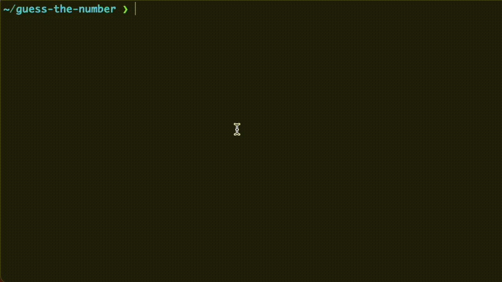

# Guess The Number
A bare metal kernel with just Guess the Number



## Features
- Guess the Number
- 32-bit
- custom bootloader
- pseudo-random number generator seeded on user input ticks

## Resources
Thanks to [@cfenollosa](https://github.com/cfenollosa)'s amazing [os-tutorial](https://github.com/cfenollosa/os-tutorial) repo

## Setup
### Steps

Build the dev container, then to build the disk image
```sh
make
```

To run, launch the qemu ui using ncurses
```sh
make qemu
```

## TODO
- [x] Better random number generator(currently has pseudo random digits but that repeat with each boot)
- [ ] Stop user from deleting the prompt

## License
[MIT License](https://github.com/luke-rt/guess-the-number/blob/master/LICENSE)
